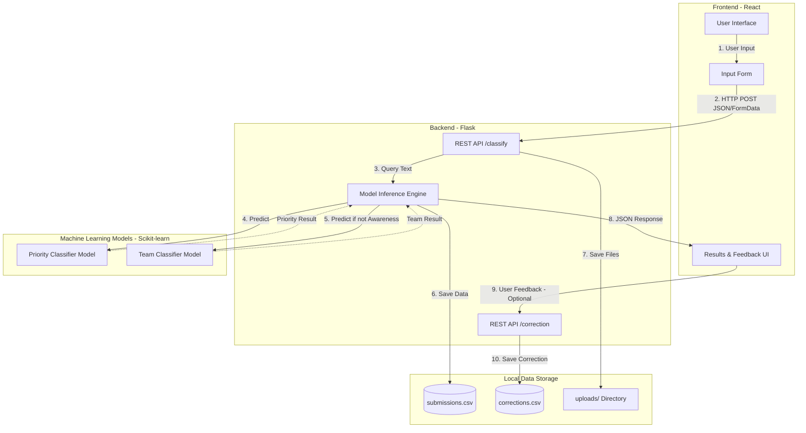
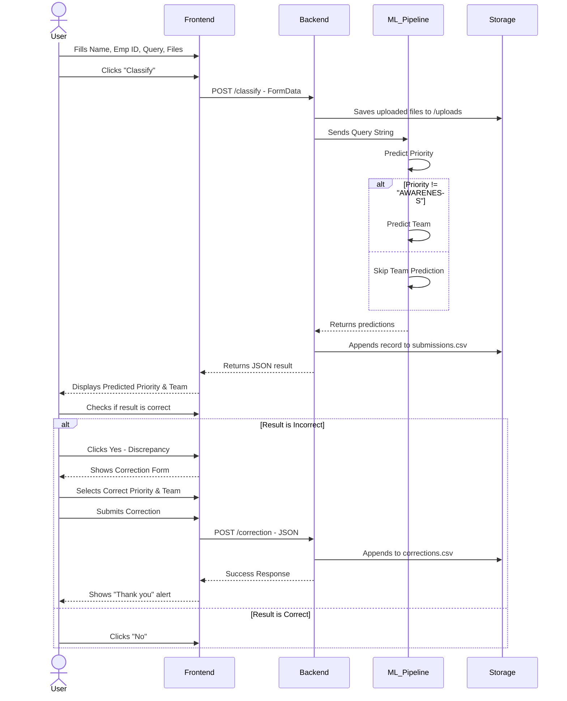

# SmartDesk Support Router: Project Explanation

Welcome to the SmartDesk Support Router project! This document serves as a comprehensive guide for new developers and stakeholders to understand how the system is architected, how data flows through it, and how to get started.

## System Architecture

The project follows a classic client-server architecture with an integrated Machine Learning pipeline.

### Component Breakdown

1.  **Frontend (React)**: Built with Create React App. It provides a clean, modern interface where employees can submit SR data (text queries and supporting files). It handles state management (form inputs, loading states) and communicates asynchronously with the Flask backend.
2.  **Backend (Flask)**: A lightweight Python web server. It exposes endpoints (`/classify` and `/correction`) to receive data from the frontend.
3.  **Machine Learning Models**: 
    *   Trained using `scikit-learn`'s `TfidfVectorizer` and `LogisticRegression`.
    *   **Priority Classifier**: Determines if an SR is 'HIGH PRIORITY URGENT TECHNICAL', 'AWARENESS', etc.
    *   **Team Classifier**: Assigns a specific team (e.g., 'TECH', 'PRODUCT') *unless* the priority is purely informational ('AWARENESS').
    *   Models are serialized and loaded via `joblib`.
4.  **Data Storage**: Simple local file-based storage using CSV files for logging submissions and corrections, acting as a lightweight database suitable for initial deployment or internal projects.

---

## Activity Flow

The following diagram illustrates the step-by-step process of handling a single Service Request.

## How to Work on This Project

### 1. Prerequisites
*   **Node.js & npm**: For running the React frontend.
*   **Python 3.x**: For running the Flask backend and ML models.

### 2. Running Locally
*   **Backend**: Navigate to the `classifiers` directory and run `python runner.py api`. This starts the server on port 5000.
*   **Frontend**: Navigate to the `frontend` directory and run `npm start`. This starts the React dev server on port 3000.

### 3. Training New Models
If the underlying dataset (`data/sr_tickets.csv`) changes, you need to retrain the models:
1.  Navigate to the `classifiers` directory.
2.  Run `python sr_classification.py`.
3.  This script will process the data, train new pipelines, print evaluation metrics, and save new `.joblib` files to the `models/` directory. The backend automatically loads these upon next startup.

## Developer Philosophy

This project aims to be **Simple, Robust, and Intuitive**.
*   **Modularity**: Keep the frontend UI logic separated from the backend ML logic.
*   **Feedback Loop**: The correction mechanism is crucial. Over time, `corrections.csv` can be merged back into `sr_tickets.csv` to retrain and improve the model accuracy.
