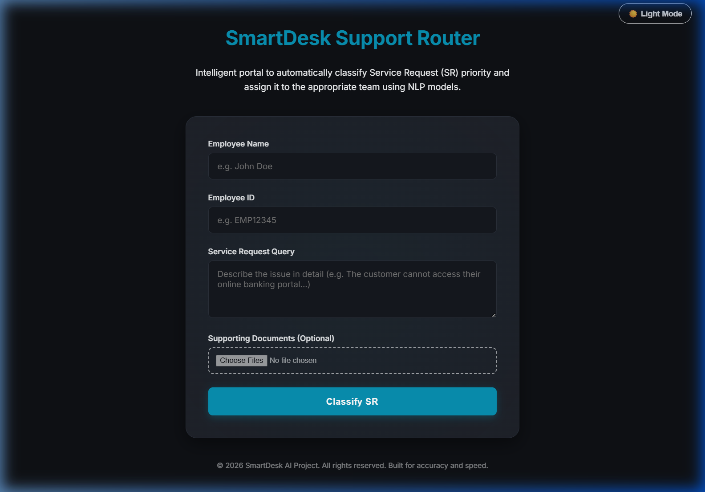
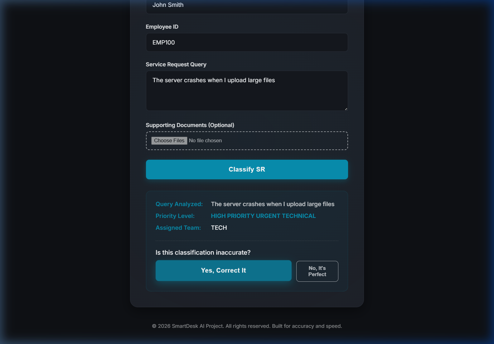
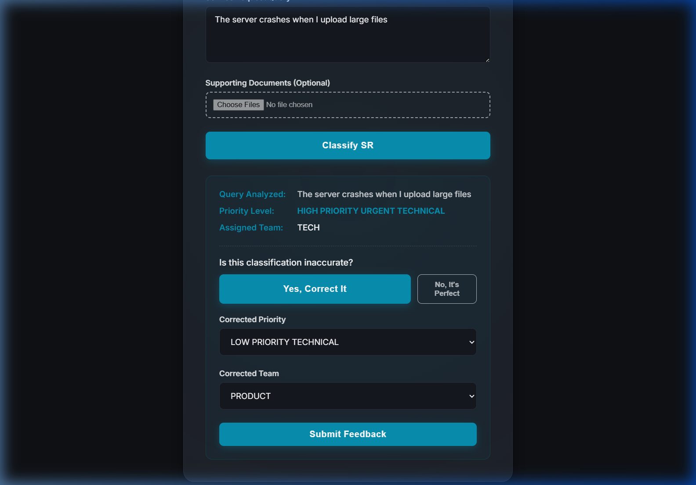
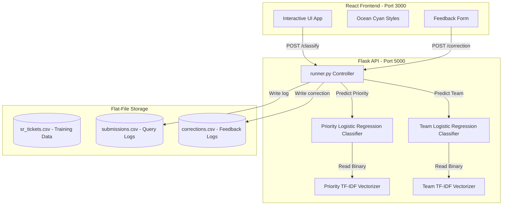
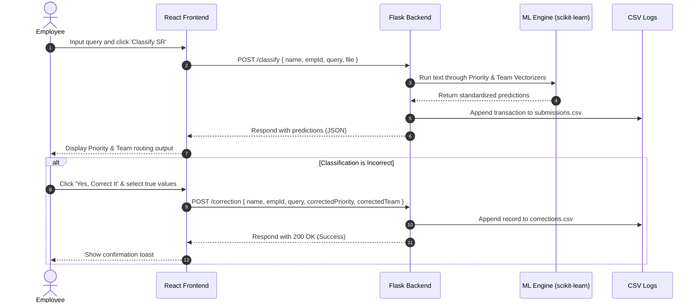

# SmartDesk Support Router 🚀

An intelligent, end-to-end support ticket classification and routing platform. SmartDesk Router leverages Natural Language Processing (NLP) to parse employee requests, automatically categorize their priority, and route technical issues to the appropriate internal teams, complete with a closed-loop feedback mechanism for model corrections.

---

## 📸 Project Interface Walkthrough

### 1. Unified Dashboard (Clean State)
A clean, streamlined employee ticket entry form built with a premium Ocean Cyan theme.


### 2. Real-Time NLP Classification Result
Once submitted, the query is analyzed in real time. The platform displays the predicted priority, assigns a routing team (or skips for awareness tickets), and presents options to accept or correct the output.


### 3. Closed-Loop Correction Feedback Form
If the model's prediction is inaccurate, employees can submit corrected tags. The dropdown fields implement dynamic conditional validation so team selection is only required for technical routing paths.


---

## ⚙️ System Architecture & Data Flow

### System Component Diagram
The diagram below details the components of the SmartDesk Router and how they interact:



### Ticket Processing Sequence
Here is the request-response lifecycle for a support query classification and correction:



---

## 📁 Repository Directory Structure

```text
SmartDesk-Support-Router/
├── classifiers/                    # Machine Learning Engine & Backend API
│   ├── runner.py                   # Flask API entry point and CLI prediction tool
│   ├── sr_classification.py        # ML Model training and evaluation script
│   └── text_utils.py               # Preprocessing utilities (stopwords, parsing)
├── data/                           # Data storage directory
│   ├── sr_tickets.csv              # Primary baseline training dataset
│   ├── submissions.csv             # Log of all incoming query classifications
│   └── corrections.csv             # Closed-loop user feedback correction log
├── diagrams/                       # High-level architecture visual assets
│   └── diagram.png
├── frontend/                       # Interactive web application
│   ├── src/
│   │   ├── App.js                  # Main React dashboard and form validation logic
│   │   ├── App.css                 # View layout, shadows, and glow animations
│   │   ├── index.js                # React bootstrapping index
│   │   └── index.css               # Core CSS variables (Ocean Cyan theme)
│   └── package.json
├── models/                         # Serialized ML model storage (generated during training)
│   ├── priority_classifier.joblib
│   ├── priority_vectorizer.joblib
│   ├── team_classifier.joblib
│   └── team_vectorizer.joblib
├── screenshots/                    # Dashboard walkthrough images
│   ├── dashboard_clean.png
│   ├── classification_result.png
│   └── correction_form.png
└── requirements.txt                # Python backend dependencies
```

---

## 🛠️ Installation & Getting Started

### Prerequisites
* **Python**: `3.8+`
* **Node.js**: `16.x+` (with `npm`)

### 1. Backend Server Setup
First, navigate to the root directory of the repository and set up a virtual environment:

```powershell
# Create virtual environment
python -m venv venv

# Activate virtual environment
# On Windows:
.\venv\Scripts\activate
# On macOS/Linux:
source venv/bin/activate

# Install dependencies
pip install -r requirements.txt
```

### 2. Frontend Application Setup
Navigate to the frontend directory and install client packages:

```powershell
cd frontend
npm install
```

---

## 🚀 Execution & Usage

### 1. Training the Machine Learning Models
If you want to train the models from scratch or retrain them after merging feedback, run the training pipeline:

```powershell
cd classifiers
python sr_classification.py
```
This script reads `data/sr_tickets.csv`, normalizes the categories, filters missing labels, fits tf-idf vectorizers, trains Logistic Regression models, and saves the binary assets into the `models/` directory.

### 2. Running the Backend API
Start the Flask backend server on `http://127.0.0.1:5000`:

```powershell
cd classifiers
python runner.py api
```

### 3. Running the Frontend Web App
Start the React development server:

```powershell
cd frontend
npm start
```
This automatically compiles and opens the browser to `http://localhost:3000`.

---

## 🔄 The Closed-Loop Training Philosophy
As support requests are routed, employees submit corrections for misclassified tickets. These corrections are recorded in `data/corrections.csv`. To close the loop:
1. Merge the rows from `data/corrections.csv` back into the primary training dataset `data/sr_tickets.csv`.
2. Clean or drop duplicates.
3. Run `python sr_classification.py` to retrain and update your models.
4. Restart the API server to apply the updated classifier logic seamlessly.
